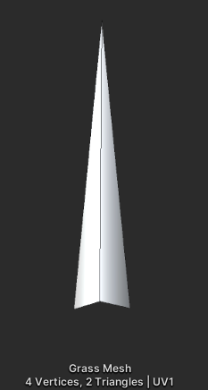
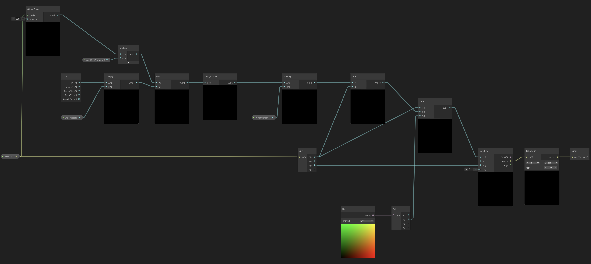
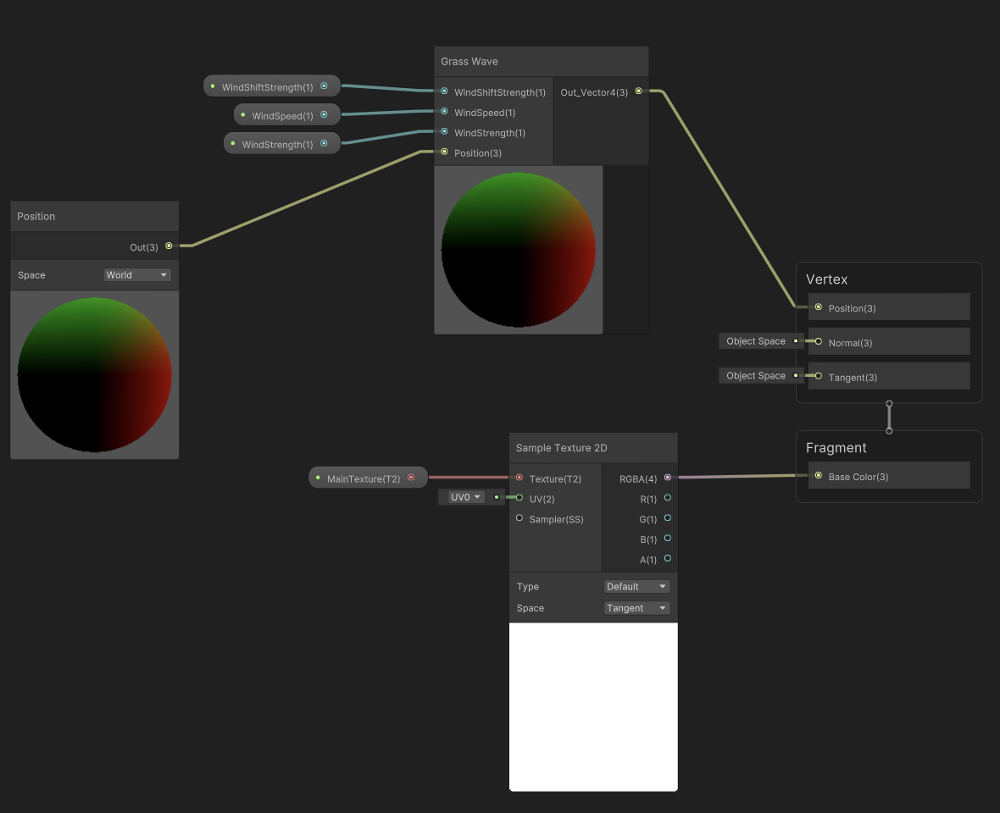
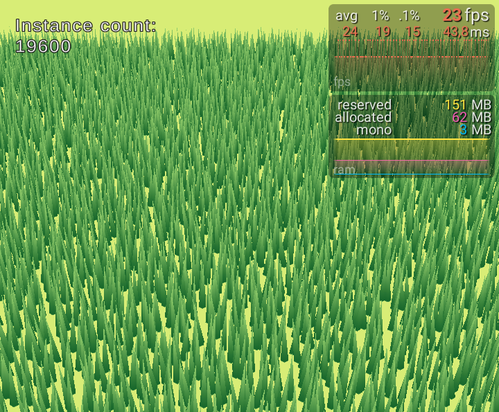
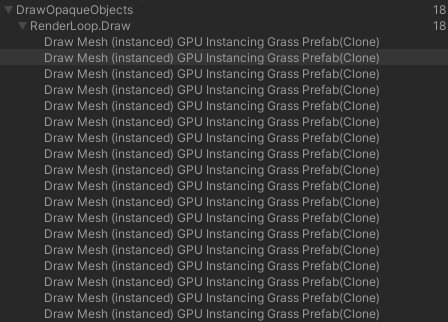
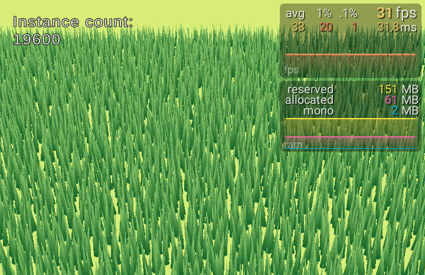
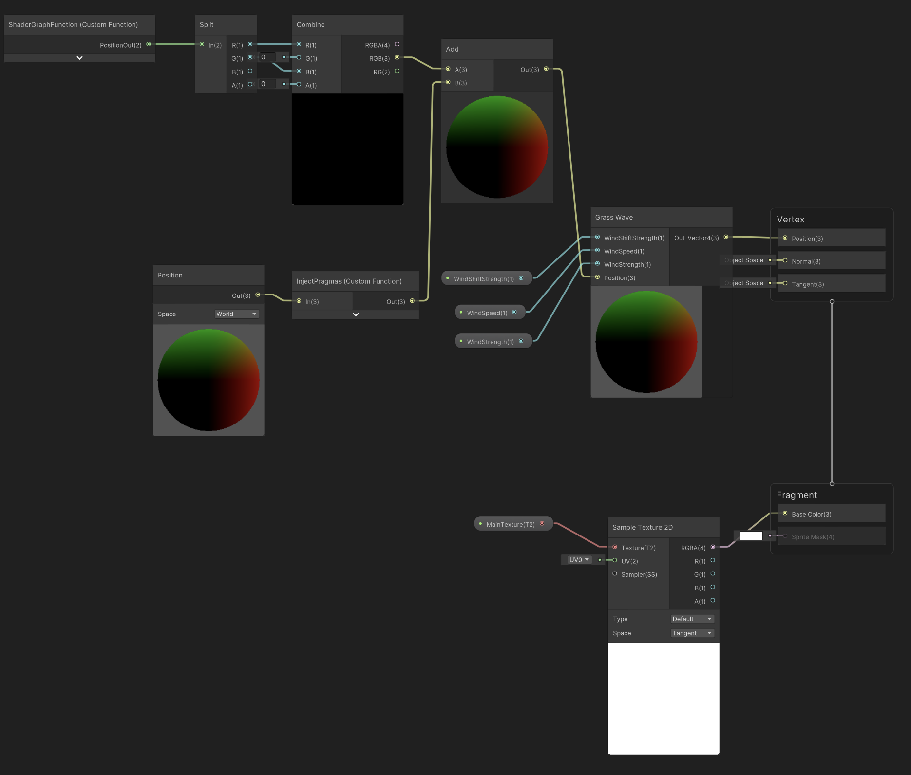
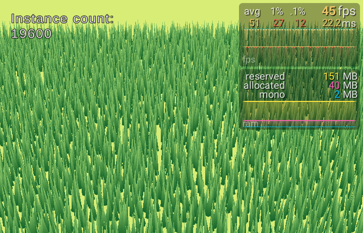
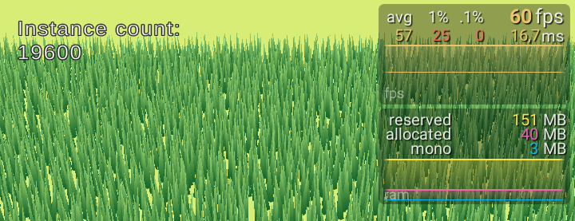
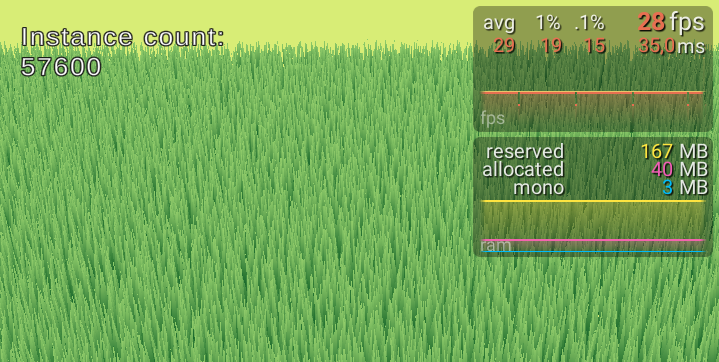

Hi! In this note I want to share the results of my experiments with GPU Instancing in Unity.

The case: mobile game, one of the elements of which is a field with grass.
Low poly style, so we don’t need photorealism.
And the player should be able to interact with the grass.
In our case, mow. We will use Unity 2021.2.7 (but in fact it is not so important) with URP.

Below you can see the final result:


### Preparation
First of all we need to create a low poly grass stalk.
Since the camera in the game never rotates, we can save a little and use a mesh with only 4 vertices:



It is unlikely that this mesh will look like grass if it remains static, so we need something that looks like wind.
We will do it with a shader and for this we need to properly prepare the UV: bottom vertices should be mapped to (u, 0) and the top one to (u, 1). Something like that:


And here is the shader subgraph for the wind effect:



As input, it takes several parameters responsible for the wind and the world position of the vertex.
To calculate its wind shear, we run the position through Simple Noise so that all the blades of grass on the stage sway out of sync.
And then through UV and Lerp we determine how much wind shear should be applied to a given vertex.

Now let’s start experimenting.

### Brute force

***It's worth to mention that all performance measurements were carried out on a pretty old Xiaomi Redmi 8A***

Before we start optimizing something we need to check if it needs to be.

Let's see how the SRP Batcher will show itself on the number of instances that will suit us visually.

Let’s make full shader:



And initialize the field:

```
_startPosition = -_fieldSize / 2.0f;
_cellSize = new Vector2(_fieldSize.x / GrassDensity, _fieldSize.y / GrassDensity);
​
var grassEntities = new Vector2[GrassDensity, GrassDensity];
var halfCellSize = _cellSize / 2.0f;
​
for (var i = 0; i < grassEntities.GetLength(0); i++) {
 for (var j = 0; j < grassEntities.GetLength(1); j++) {
   grassEntities[i, j] = new Vector2(_cellSize.x * i + _startPosition.x, _cellSize.y * j + _startPosition.y) + new Vector2(
   Random.Range(-halfCellSize.x, halfCellSize.x),
   Random.Range(-halfCellSize.y, halfCellSize.y));
 }
}
_abstractGrassDrawer.Init(grassEntities, _fieldSize);
```

We generate a uniform field with a small amount of randomness.
It’s flat, so Vector2 will suffice for the coordinates.
And then we just instantiate the grass.

```
public override void Init(Vector2[,] grassEntities, Vector2 fieldSize) {
 _grassEntities = new GameObject[grassEntities.GetLength(0), grassEntities.GetLength(1)];
 for (var i = 0; i < grassEntities.GetLength(0); i++) {
   for (var j = 0; j < grassEntities.GetLength(1); j++) {
     _grassEntities[i, j] = Instantiate(_grassPrefab,
     new Vector3(grassEntities[i, j].x, 0.0f, grassEntities[i, j].y), Quaternion.identity);
   }
 }
}
```
And here is what we got:



Visually, we achieved what we wanted (in the real game there is another camera angle, a lot of decorations, textured ground and so on, so it looks better, though instances count is the same: 15-20k).
But the FPS is too low. Therefore we need to try optimizations.

### GPU Instancing

According to the [official documentation](https://docs.unity3d.com/2021.2/Documentation/Manual/GPUInstancing.html) it is what we need.
So let’s try.

In our grass material’s inspector we can find an option “Enable GPU instancing” and turn it on.
But unfortunately it’s [not that simple](https://forum.unity.com/threads/srp-batcher-and-gpu-instancing.833362/).
If we run the scene and look at the Frame Debugger we can see that SRP Batcher is still running.
It’s because these two technologies are not compatible and we need to somehow turn off SRP Batcher.
There are several ways how to do it:

#### 1. Turn it off in the URP Settings

Not recommended. Moreover, in the latest Unity versions this option is hidden.
It is possible to turn it off through inspector’s Debug mode.
But we won’t do it, because besides grass there are many other things in our game for which SRP Batcher suits us.

#### 2. Make the shader incompatible with SRP Batcher

Not the most convenient way as we need to edit the shader itself.
And in case of Shader Graph we need to generate the shader’s code first.
And after any further change of the graph we have to do it again.
Next, according to the documentation: *"Add a new [material property](https://docs.unity3d.com/Manual/SL-Properties.html) declaration into the shader’s Properties block.
Don’t declare the new material property in the UnityPerMaterial constant buffer"*.
But I did easier and just commented out buffer declaration:

```
//CBUFFER_START(UnityPerMaterial)
float4 _MainTexture_TexelSize;
half _WindShiftStrength;
half _WindSpeed;
half _WindStrength;
//CBUFFER_END
```

Despite some inconvenience of this method, I chose it.
Because I didn’t want to change my prefabs or instantiation logic.

#### 3. Make the renderer incompatible with SRP Batcher

The simplest one. And sometimes we need to share the same material between different objects.
We just need to set [MaterialPropertyBlock](https://docs.unity3d.com/ScriptReference/MaterialPropertyBlock.html) to the renderer, because it is [not compatible with SRP Batcher](https://forum.unity.com/threads/materialpropertyblock-and-srp-batcher.815499/).
Besides that, MaterialPropertyBlock could be very useful in case when we want to assign individual properties to different instances (e.g color).
And after one of the above we can see that instancing is working:



Let’s take measurements:



### Graphics API

We can use GPU Instancing directly through the Graphics API, without the need of GameObjects.
And here we also have 3 ways:

#### 1. [Graphics.DrawMeshInstanced](https://docs.unity3d.com/ScriptReference/Graphics.DrawMeshInstanced.html)

The easiest one. Just pass a mesh, a material and an array of matrices. Doesn’t require a special shader, but is limited to 1023 instances per call. Therefore, it does not suit us.

#### 2. [Graphics.DrawMeshInstancedProcedural](https://docs.unity3d.com/ScriptReference/Graphics.DrawMeshInstancedProcedural.html)

Doesn’t have limitations on instance count.
But positions can no longer be passed directly, we need to pass it as a ComputeBuffer directly to the material.
Therefore it requires shader modifications to work with it. We will use this method.

#### 3. [Graphics.DrawMeshInstancedIndirect](https://docs.unity3d.com/ScriptReference/Graphics.DrawMeshInstancedIndirect.html)

Almost the same as previous, except that instance count should be passed in ComputeBuffer.
Useful in case when we make preparations in Compute shader rather than c# script.

So we decided to use DrawMeshInstancedProcedural. First, we will pass the positions of our instances to the material:

```
_positionsCount = _positions.Count;
_positionBuffer?.Release();
if (_positionsCount == 0) return;
_positionBuffer = new ComputeBuffer(_positionsCount, 8);
_positionBuffer.SetData(_positions);
_instanceMaterial.SetBuffer(PositionsShaderProperty, _positionBuffer);
```

Next, we need to call Draw method every frame:
```
private void Update() {
 if (_positionsCount == 0) return;
 Graphics.DrawMeshInstancedProcedural(_instanceMesh, 0, _instanceMaterial,
    _grassBounds, _positionsCount,
    null, ShadowCastingMode.Off, false);
}
```
We can try it immediately, but all of the thousands instances will be rendered in the same place, 
because now the shader has to take their positions from the ComputeBuffer.

So let’s modify the shader:



Here you can see 2 new nodes with custom functions.

The first one is just a dummy node to enable procedural rendering.
We have to include the #pragma instancing_options compiler directive.
It has to be injected in the generated shader source code directly, and cannot be included via a separate file.

```
#pragma instancing_options procedural:ConfigureProcedural
Out = In;
```

The second one extracts the instance position from the buffer and can be included via a separate file.

```
#if defined(UNITY_PROCEDURAL_INSTANCING_ENABLED)
StructuredBuffer<float2> PositionsBuffer;
#endif
​
float2 position;
​
void ConfigureProcedural () {
   #if defined(UNITY_PROCEDURAL_INSTANCING_ENABLED)
   position = PositionsBuffer[unity_InstanceID];
   #endif
}
​
void ShaderGraphFunction_float (out float2 PositionOut) {
   PositionOut = position;
}
​
void ShaderGraphFunction_half (out half2 PositionOut) {
   PositionOut = position;
}
```

And the measurements:



In addition to good performance, this method allows us to use the Compute Shaders to [calculate procedural animations directly on the GPU](https://www.ronja-tutorials.com/post/051-draw-procedural/).

### Some more optimization

The camera in our game doesn’t rotate, it only moves along the Z axis.
Therefore let’s add simple culling.
Since we placed the grass on a grid, we can roughly estimate what part we should display at the moment.

Check the camera position and calculate the bounds:

```
private void Update() {
   if (_camera.transform.hasChanged) {
      UpdateCameraCells();
   }
}
​
private Vector3 Raycast(Vector3 position) {
   var ray = _camera.ScreenPointToRay(position);
   _plane.Raycast(ray, out var enter);
   return ray.GetPoint(enter);
}
​
private void UpdateCameraCells() {
   if (!PerformCulling) {
      _abstractGrassDrawer.UpdatePositions(Vector2Int.zero, new Vector2Int(GrassDensity, GrassDensity));
      return;
   }
   var bottomLeftCameraCorner = Raycast(Vector3.zero);
   var topLeftCameraCorner = Raycast(new Vector3(0.0f, Screen.height));
   var topRightCameraCorner = Raycast(new Vector3(Screen.width, Screen.height));
   var bottomLeftCameraCell = new Vector2Int(
      Mathf.Clamp(Mathf.FloorToInt((topLeftCameraCorner.x - _startPosition.x) / _cellSize.x), 0,
         GrassDensity - 1),
      Mathf.Clamp(Mathf.FloorToInt((bottomLeftCameraCorner.z - _startPosition.y) / _cellSize.y), 0,
         GrassDensity - 1));
​
   var topRightCameraCell = new Vector2Int(
      Mathf.Clamp(Mathf.FloorToInt((topRightCameraCorner.x - _startPosition.x) / _cellSize.x) + 1, 0,
         GrassDensity - 1),
      Mathf.Clamp(Mathf.FloorToInt((topRightCameraCorner.z - _startPosition.y) / _cellSize.y) + 1, 0,
         GrassDensity - 1));
   _abstractGrassDrawer.UpdatePositions(bottomLeftCameraCell, topRightCameraCell);
}
```

Next we need to update the ComputeBuffer according to the bounds:

```
public override void UpdatePositions(Vector2Int bottomLeftCameraCell, Vector2Int topRightCameraCell) {
   _positions.Clear();
   for (var i = bottomLeftCameraCell.x; i < topRightCameraCell.x; i++) {
      for (var j = bottomLeftCameraCell.y; j < topRightCameraCell.y; j++) {
         _positions.Add(_grassEntities[i, j]);
      }
   }
​
   _positionsCount = _positions.Count;
   _positionBuffer?.Release();
   if (_positionsCount == 0) return;
   _positionBuffer = new ComputeBuffer(_positionsCount, 8);
   _positionBuffer.SetData(_positions);
   _instanceMaterial.SetBuffer(PositionsShaderProperty, _positionBuffer);
}
```

And now measure the most performant variant:



And this is how it looks on acceptable for some games ~30 FPS:



It's worth to mention a noticeable gain in memory usage due to the refusal to use GameObject

### Limitations

Unfortunately, GPU Instancing may not work on some devices.
You could check  this with SystemInfo.supportsInstancing.
In that case we will use the ‘fallback’ variant with GameObjects (maybe in less count).
Performance will be worse, but at least it will work.

### Afterword

This is not a detailed article about GPU Instancing, but just my notes about a small experiment.
You can read more in this [awesome blog](https://catlikecoding.com/unity/tutorials/basics/compute-shaders/).

And you can find the sources of this experiment [here](https://github.com/utkaka/unity-gpu-instanced-grass).